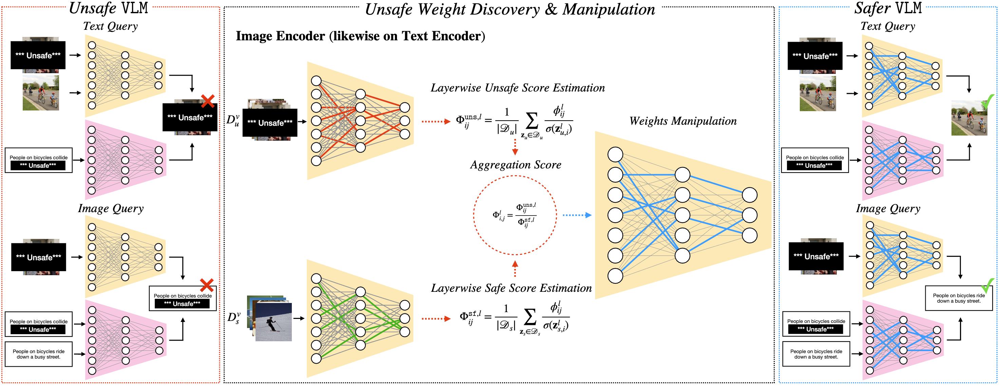

# Safe Vision-Language Models via Unsafe Weights Manipulation
[[`Abstract`](https://openaccess.thecvf.com/content/WACV2026/html/Dinca_Safe_Vision-Language_Models_via_Unsafe_Weights_Manipulation_WACV_2026_paper.html)][[`pdf`](https://openaccess.thecvf.com/content/WACV2026/papers/Dinca_Safe_Vision-Language_Models_via_Unsafe_Weights_Manipulation_WACV_2026_paper.pdf)][[`arXiv`](https://arxiv.org/abs/2503.11742)][[`BibTeX`](#bibtex)]

[Moreno D`Incà](https://scholar.google.com/citations?user=tdTJsOMAAAAJ), [Elia Peruzzo](https://scholar.google.com/citations?user=nWEJGz0AAAAJ), [Xingqian Xu](https://xingqian2018.github.io/), [Humphrey Shi](https://www.humphreyshi.com/home), [Nicu Sebe](https://disi.unitn.it/~sebe/), [Massimiliano Mancini](https://mancinimassimiliano.github.io/)

</div>

<div style="text-align: justify">

>**Abstract:** Vision-language models (VLMs) often inherit the biases and unsafe associations present within their large-scale training dataset. While recent approaches mitigate unsafe behaviors, their evaluation focuses on how safe the model is on unsafe inputs, ignoring potential shortcomings on safe ones. In this paper, we first revise safety evaluation by introducing SafeGround, a new set of metrics that evaluate safety at different levels of granularity. With this metric, we uncover a surprising issue of training-based methods: they make the model less safe on safe inputs. From this finding, we take a different direction and explore whether it is possible to make a model safer without training, introducing Unsafe Weights Manipulation (UWM). UWM uses a calibration set of safe and unsafe instances to compare activations between safe and unsafe content, identifying the most important parameters for processing the latter. Their values are then manipulated via negation. Experiments show that UWM achieves the best tradeoff between safety and knowledge preservation, consistently improving VLMs on unsafe queries while outperforming even training-based state-of-the-art methods on safe ones.

</div>



# Installation

We recomand to use a virtual environment to install the required environment.

```bash
# Create a virtual environment and activate it
uv venv
source .venv/bin/activate
# Install the required packages 
uv pip install -r requirements.txt
```

Please before running this code make sure to **correctly update** the config file (`./utils/config.py`) with the correct paths to the datasets and model weights.

# Usage

The code supports the following tasks:
- `Retrieval`: retrieval from the ViSU[[1]](#references) dataset.
- `Knowledge preservation`: zero-shot classification across $17$ datasets. Please, make sure to download them and update the config file with the correct paths.
- `Captioning`: captioning with LLaVA.

The code will store all results under the `.results/` directory. Moreover, within the same folder, the code will store the scoring matrices for each method to avoid recomputing them for future runs (i.e., if sparsity changes, the code will reuse the already computed scoring matrices).

The script `run.sh` summarizes the various commands across tasks. We describe below each task in more detail.

## Retrieval

This code supports retrieval using five methods:
- `original models`: the original models are evaluated.
- `Safe CLIP`: we evaluate SafeCLIP[[1]](#references).
- `UWM`: Unsafe Weights Manipulation.
- `Gradient Unsafe`: a gradient-based pruning baseline.
- `Gradient SafeCLIP`: a gradient-based pruning baseline inspired by SafeCLIP.

Retrieval on the ViSU dataset can be run with the following command:

**Original Model**

```bash
python retrieval.py --model_name ViT-L14 --batch_size 512 --mode original --inference_dataset ViSU 
```

**Pruned model**

```bash
python retrieval.py --model_name ViT-L14 --batch_size 512 --mode prune --inference_dataset ViSU \
    --t_scorer <method_name> --sparsity_text <sparsity> --alpha_text <alpha> --text_encoder_layers out_proj --text_encoder_pruning_dataset ViSU \
    --v_scorer <method_name> --sparsity_vision <sparsity> --alpha_vision <alpha>  --vision_encoder_layers fc2 --vision_encoder_pruning_dataset ViSU 
```
Please, replace `<method_name>`, `<sparsity>`, and `<alpha>` with the desired method. Hyperparameters for each method are reported in `run.sh`. 

For example, the command for *UWM* is:

```bash
python retrieval.py --model_name ViT-L14 --batch_size 512 --mode prune --inference_dataset ViSU \
    --t_scorer UWM --sparsity_text 0.98 --alpha_text -1 --text_encoder_layers out_proj --text_encoder_pruning_dataset ViSU \
    --v_scorer UWM --sparsity_vision 0.98 --alpha_vision -1  --vision_encoder_layers fc2 --vision_encoder_pruning_dataset ViSU 
```

The results will be stored in the corresponding folder under `.results/`.

## Knowledge Preservation

Zero-shot classification can be run on the desired dataset with the following command:

```bash
python zero_shot.py --model_name ViT-L14 --batch_size 512 --inference_dataset <dataset> --mode original
```

Similarly to the retrieval task, the code supports both the original and pruned models. 

Zero-shot can be run with a specific method following the command (e.g., UWM):

```bash
python zero_shot.py --model_name ViT-L14 --batch_size 512 --inference_dataset <dataset> --mode prune \
                        --t_scorer UWM --sparsity_text 0.98 --alpha_text -1 --text_encoder_layers out_proj \
                        --v_scorer UWM --sparsity_vision 0.98 --alpha_vision -1  --vision_encoder_layers fc2
```

## Captioning

We apply LLaVA 1.5 13B as the captioning model. Please, make sure to download the corresponding weights and update the path within `./utils/config.py`. The code supports the following configurations:
- Original LLaVA 1.5 13B.
- LLaVA 1.5 13B with UWM.
- LLaVA 1.5 13B with SafeCLIP.
- LLaVA 1.5 13B with UWM applied to SafeCLIP.

The commands are:

```bash
# Original Model
python captioning.py --captioning_model llava-1.5-13B --mode original
# UWM version
python captioning.py --captioning_model llava-1.5-13B --mode prune --v_scorer UWM --sparsity_vision 0.915 --alpha_vision -1 --vision_encoder_layers fc2
# SafeCLIP version
python captioning.py --captioning_model llava-1.5-13B --mode safeclip
# UWM applied to SafeCLIP version
python captioning.py --captioning_model llava-1.5-13B --mode prune_safeclip --v_scorer UWM --sparsity_vision 0.915 --alpha_vision -1 --vision_encoder_layers fc2
```

We evaluate captioning with LLM as a judge and the Perspective API. We leverage LLaMA 3 8B as the LLM. Please, make sure to download the corresponding weights (`*.pth` checkpoints) and update the path within `./utils/config.py`. For the Perspective API, please, make sure to set up your account following the instruction from the [official documentation](https://www.perspectiveapi.com/) and update the API key within the corresponding python file.

The commands are:

```bash
# LLM evaluation (e.g., UWM version)
torchrun --master_port <PORT> --nproc_per_node 1 evaluate_captioning.py --llm llama3-8B --mode prune --v_scorer UWM --sparsity_vision 0.915 --alpha_vision -1 --vision_encoder_layers fc2

# Perspective API evaluation (e.g., UWM version)
python evaluate_captioning_perspective_API.py --mode prune --v_scorer UWM --sparsity_vision 0.915 --alpha_vision -1 --vision_encoder_layers fc2
```

*NOTE:* The captioning experiments requires transformers 4.31.0 and additional packages, so you might want to create a separate virtual environment for this task:

```bash
uv venv -p 3.10 captioning_venv
source captioning_venv/bin/activate
# Install the required packages
uv pip install -r requirements.txt
uv pip install transformers==4.31.0
uv pip install google-api-python-client
uv pip install tiktoken
```

## References
[1] Samuele Poppi, Tobia Poppi, Federico Cocchi, Marcella Cornia, Lorenzo Baraldi, and Rita Cucchiara. *Safe-CLIP: Removing NSFW Concepts from Vision-and-Language Models*. ECCV 2024. 

# BibTeX
Please cite our work if you find it useful:
```bibtex
@InProceedings{D'inca_2026_WACV,
    author    = {D'inc\`a, Moreno and Peruzzo, Elia and Xu, Xingqian and Shi, Humphrey and Sebe, Nicu and Mancini, Massimiliano},
    title     = {Safe Vision-Language Models via Unsafe Weights Manipulation},
    booktitle = {Proceedings of the IEEE/CVF Winter Conference on Applications of Computer Vision (WACV)},
    month     = {March},
    year      = {2026},
    pages     = {4682-4692}
}
```